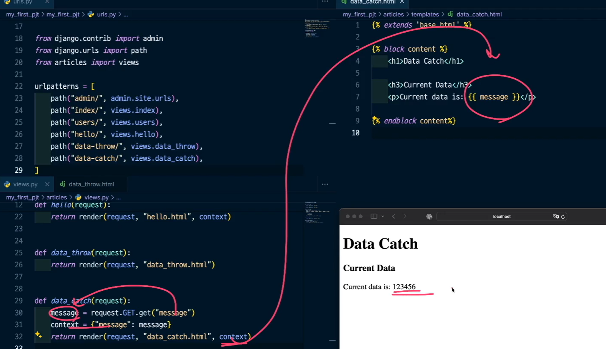
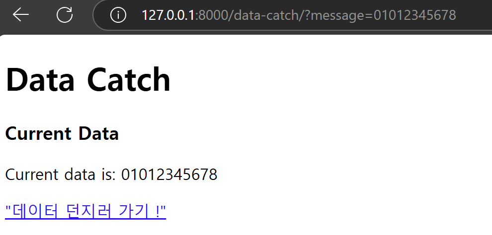

### HTTP methods

#### HTTP란?

- 하이퍼텍스트 전송 프로토콜 (Hyper Text Transfer Protocol)
- 여러가지 리소스를 보내고 받을 때 사용하는 **프로토콜 (통신규약) == 약속**이다.
    - 많은 약속들 중의 하나가 HTTP
    
- 요청(request)와 응답(response)로 이루어지는 통신이다.
- 웹에서 이루어지는 데이터 교환의 기초라고 할 수 있다.

#### HTTP Methods

- HTTP에서 수행할 작업을 나타낸다.
- 특정 자원에 대해 내가 수행하고자 하는 동작을 method로 정의한다.
- **GET**, POST, PUT, DELETE, … 등이 있다.

본문에서 사용하는는 코드는 "GET"을 사영한 HTTP Methods의 예시이다.
Get Method를 중심으로 살펴보자.

----

### GET

- 특정한 자원(html 같은)을 조회하는데 사용한다.

```
<form action="" method="GET">

		<label for="message">메세지 입력</label>
		<input type="text" id="message" name="message">
		<button type="submit">전송</button>

</form>
```

- 위 예제를 보면, method의 빈문자열에 "GET(소문자로 작성해도 되는데, 보기 쉽게하기 위해서 대문자로 작성했다.)"를 넣고, 서버 페이지에 값을 입력하게되면, 현재 URL에다가 내가 입력한 데이터를 넣어 다시 지금 있는 페이지로 url를 보낸 것을 볼 수 있다. 아무것도 바뀐게 없는 것이 아닌, Method에 아무것도 없거나(빈문자열) 알아볼 수 없다면, 기본적으로 Get 방식을 사용하기에 기존과 똑같은 방식으로 보이는 것이다.
- 즉,**method를 명시하지 않거나 존재하지 않는 메서드의 경우 기본적으로 GET으로 처리하기 때문이다.**

- 데이터를 서버로 전송할 때 **쿼리스트링**(Query String Parameters)를 사용해서 전송한다.

#### 쿼리스트링이란?
- 웹 URL에서 서버로 데이터를 전달하는 방법 중 하나 
- 서버에 값을 입력하고 나면 나오는 주소창에, `?message=loving_you` 부분은 **쿼리스트링**이라는 형식이다.
- 보통 웹 페이지의 주소(URL) 끝에 `?` 뒤에 데이터가 위치하고, 이를 key와 value 값으로 나타낸다. 
    - 작성된 부분 중 ?로 시작하는 부분부터 쿼리스트링이고, 이후 `&` 로 연결된 `key=value` 형태가 나온다.

- 즉, URL에 데이터가 포함되어, 사용자가 입력한 정보나 필터 조건 등을, 서버로 전달할 수 있다.
- 예시: 

---

#### Key란? Value란?

- key는 Form에 있는 name이고, Vaule는 유저가 입력한 값을 나타낸다. 
- key와 value는 한 쌍으로 같이 움직인다. 
- 만약 여러 개일 경우, 앰퍼샌트(&)를 붙여 연결해서 데이터를 전송해준다.


---
### 서버에서 데이터 받기

- 클라이언트에서 **GET 방식**으로 보낸 데이터를 서버에서 받게된다.
    
    = **쿼리스트링 방식**
    
- 이러한 데이터를 받는 방식은 사용하는 ‘도구’ 마다 구현방식이 다릅니다.
    
    = **현재 Django만 이해해도 괜찮다.**

----


### 예제를 이용한 데이터 받기


1. 기존 코드에 data_catch.html 만들어 서버에 연결하고 준비한다.


2. 기존 data_throw 코드에서 데이터를 어디로 보낼 지, 작성되어있지 않기에, 이를 data_catch로 보낼 것을 url로 작성하면 된다.
- `data_throw.html`을 수정해서(Form action), 데이터를 받을 곳이 마련되었으니 이곳으로 데이터를 보내면 된다.


3. 서버에 접속해서 값을 입력하면, 연결한 data-catch 화면으로 넘어가게 된다.


4. url 데이터(위 예제에서는 01012345678)를 받아, 처리해서 화면으로 보여주고 싶다는 것은 데이터를 View로부터 받아서 Template으로 보여주고 싶다는 방식과 동일하다. 이를 Context(render의 세번 쨰 자리)로 Template에 보여줄 데이터를 넘기면 된다.
- 쉽게 말하면 뭔가 데이터가 잘 넘어오긴했는데 넘어온 데이터를 받아서 보여주고 싶다 == 데이터를 받아서 (View) → 보여주고 싶다 (Template) → **Context **

5-1. 데이터가 넘어왔으니, data_catch.view로 시작으로 다음과 같이 진행한다.


5-2. message, 즉 get을 사용해서 꺼낸 message를 context= {"message" : message}로 담아서 render 세번째 자리에 전송해준다.


6. 이후 Template에서는 전송받은 context 를 이용해서, 화면으로 보이는 `datch_catch.html`를 수정해서 이곳에 데이터를 보내주면 된다.


위 message 전송을 다음 사진으로 한번에 볼 수 있다.
View가 message를 꺼내서  context에 담아 보내고, 받아서 html, 즉 데이터를 보여주고 있는 과정이다.



---
### 하이퍼링크
입력하고 받고, 다시 입력하고 받고.. 반복하고 싶을 때 **하이퍼링크**를 **< a >** 태그를 이용해서서 만들면된다.

- `href="http://127.0.0.1:8000/data-throw/"` 처럼, url로 작성해도 된다.
- 모든 주소 대신 /data-throw/만 적어줘도 동작한다.




- print로 출력해보면, 보다 정확한 값을 알 수 있다.

- `request`는 `WSGIRequest`클래스의 인스턴스로 요청에 대한 모든 메타데이터가 들어있다.
- `request.GET`은 `QueryDict` 타입이다.
    - 타입 == 클래스 
    - `QueryDict`는 Dict를 상속한 클래스로 `request.GET`, `request.POST`속성은 모두 `QueryDict`의 인스턴스이다.
    - 일반적인 dict보다 HTTP특성의 필요한 기능들이 있어 추가적으로 구현한 클래스이다.

---
### 요청이 처리되는 과정 정리

요청이 들어오면 Django는 `**HttpRequest` 객체**를 생성
→ **urls**에서 지정한 **view 함수의 첫번째 인자**로 전달 
→ **view**는 처리 후, **`HttpResponse`** **전달**

---
### 공부 참고 사이트

MDN 공식문서 (https://developer.mozilla.org/ko/)