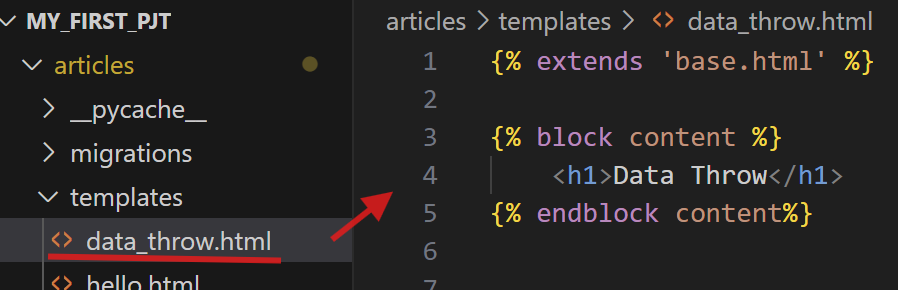

### HTML이란?
HTML(하이퍼텍스트 마크업 언어, HyperText Markup Language)는 **웹 페이지를 구성하는 데 사용되는 표준 마크업 언어**이다. 
- HTML은 웹 콘텐츠를 구조적으로 표현하는 언어로, 웹 브라우저가 이해할 수 있도록 텍스트, 이미지, 비디오 등 다양한 요소를 구조화하는 데 사용된다.
- Html 같은 것을 리소스, 자원이라고 한다.
---

#### HTML Form(형식) 요소

- 웹에서 유저에게 데이터를 입력받는 형식을 버튼, 텍스트, 드랍다운, 선택 등 여러 가지로로 제공한다.
- 유저의 데이터를 서버로 전송하는 역할을 한다.
- 이를 `action`과 `method`를 사용한다.

----
#### `action`과 `method`(1)

1. `action`
- 데이터가 전송될 URL을 지정한다.
- 지정하지 않을경우 현재 페이지의 URL로 데이터를 전송한다.

2. `method`
- 데이터를 전송하는 방식(HTTP request method)을 지정한다.
- HTML Form은 `GET` 방식 또는 `POST` 방식으로만 전송이 가능하다.

----
#### `action`과 `method`(2)
- Form 태그 내 속성 
- **데이터를 어디로(action) 어떤 방식(method)를 이용해서 보낼지 결정**하는 속성이다.
- 코드 내 label 태그에서 for은 input의 id와 일치해야한다.
- 만약에 action 속성이 지정되지 않거나, 빈문자열로 지정된 경우, 접속한 URL(현재 페이지의 URL)로 다시 데이터를 전송한다.
- 관련 코드 예시는 다음과 같다.
```
<form action="/submit/" method="post">
    <label for="username">사용자 이름:</label><br>
    <input type="text" id="username" name="username" required><br>
    
    <label for="email">이메일 주소:</label><br>
    <input type="email" id="email" name="email" required><br>
    
    <label for="password">비밀번호:</label><br>
    <input type="password" id="password" name="password" required><br>
    
    <input type="submit" value="가입하기">
</form>
```
----

#### data-throw 복습 및 작성
1. urls.py에 다음과 같이 작성한다.

- urls.py의 views를 ctrl하고 클릭하면 views.py로 이동할 수 있다. 

2. views.py에 관련 코드를 작성해준다.


3. 그리고 data.html을을 templates 폴더에 생성한다.
- 모든 코드를 다 작성하는 것이 아닌, 배운 것을 활용해서 상속을 이용해서 작성한다.


4. 서버에 접속하면 "Data Throw"라고 작성된 h1태그 내용이 보인다.


---

### Form 작성하기
1. form 태그를를 이용해서 action과 method는 #을 작성해도도 되고, 비워도 된다.
```
<form action="#" method="#">

</form>
```
```
<form action="" method="">

</form>
```

2. form 태그를 작성하기 위해, 쉽게말하면 구멍을 뚫는 작업인, 입력할 수 있는 곳을 만들어주기 위해 input을 기존 코드에 추가 작성한다.

```



    <h1>Data Throw</h1>

    <form action="" method="">

        <input type="text">

    </form>

    


```
3. 작성 가능해진 input 기능과 함께 서버 화면에 나타나게된다.


4. 제출 버튼과 Label 넣기
추가적으로, 라벨 및 input의 id까지 작성해주면 다음과 같다.
- `label for`와 `input id`는 일치해야해한다.
- 사실 기능동작과는 관계가 없지만, 동일하게 하면 `label`과 `input`을 묶어줄 수 있습니다! 그러면 `label`을 클릭해도 `input`이 선택되도록 할 수 있다.
- 즉, 작은 스마트폰 기기와 같이, 편리를 위해 label을 입력해도 바로 input으로 커서가 가도록 하기위해서다.


```



    <h1>Data Throw</h1>

    <form action="" method="">

        <label for="my-data">데이터 입력 : </label>
        <input type="text" id="my-data">

    </form>



```


전송 버튼을 만들기 후에, button 태그를 사용한다.
- `button type`을 꼭 `submit`으로 해야 버튼이 Form의 데이터를 전송하는 기능을 할 수 있다. 

```
<form action="" method="">

		<label for="message">메세지 입력</label>
		<input type="text" id="message" name="message">
		<button type="submit">전송</button>

</form>
```


---


---


#### input 요소

`input`
- form에서 사용자의 입력을 받기 위해 사용한다.
- `type` 속성에 따라 입력 동작 방식이 달라진다.
    - 지정하지 않을경우 `type=text`로 인식한다.
    

---
#### `name` 속성이 필요한 이유
- 본문 코드에서는 name 없이 작동했으나, 실제로 많은 코드를 사용할 경우, 편리를 위해 name을 작성해야한다.
- `name`으로 서버에 데이터를 전달하고, 서버는 `name`을 보고 데이터를 판단한다.
- form을 제출(submit)하면 `name`속성에 설정된 값이 서버로 전송된다.
- 서버에서는 `name`속성을 사용하여 값에 접근한다.
    - 즉, `name`속성이 없다면 서버가 데이터를 받을 수 없다.
    - `name`속성의 값이 key가 되고, 사용자가 입력한 값이 value가 되어 전송된다.

- input에 `name ="message"`  이름을 지정해주고, 이름이 있는 것이랑 안한 것과 비교해보면, 이는 데이터 전송 유무의 차이를 보여준다.
- 또한 form은 데이터 어디로, 어떤 방식으로 전송할 지 정해준다. 이에 위 코드에서는 **빈문자열**로, **action과 method가 명시되어 있지 않는 것**과 같기에, 데이터를 **내가 지금 들어온 url**로 전송하게 된다.
